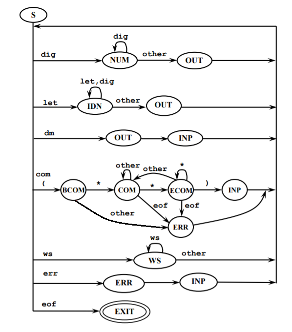

1. \<signal-program> --> \<program>

2. \<program> --> PROGRAM \<procedure-identifier> ;
               \<block>.

3. \<block> --> \<variable-declarations> BEGIN
             \<statements-list> END

4. \<variable-declarations> --> VAR \<declarations-list> |
                                   \<empty>

5. \<declarations-list> --> \<declaration>
                         \<declarations-list> |
                         \<empty>

6. \<declaration> --> \<variable-identifier>:\<attribute> ;

7. \<attribute> --> INTEGER |
                 FLOAT

8. \<statements-list> --> \<statement> \<statementslist> |
                       \<empty>

9. \<statement> --> \<condition-statement> ENDIF ;

10. \<condition-statement> --> \<incompletecondition-statement>\<alternative-part>

11. \<incomplete-condition-statement> --> IF
                                       \<conditional-expression> THEN
                                       \<statements-list>

12. \<alternative-part> --> ELSE \<statements-list> |
                         \<empty>

13. \<conditional-expression> --> \<expression> = \<expression>

14. \<expression> --> \<variable-identifier> |
                   \<unsigned-integer>

15. \<variable-identifier> --> \<identifier>

16. \<procedure-identifier> --> \<identifier>

17. \<identifier> --> \<letter>\<string>

18. \<string> --> \<letter>\<string> |
               \<digit>\<string> |
               \<empty>

19. \<unsigned-integer> --> \<digit>\<digits-string>

20. \<digits-string> --> \<digit>\<digits-string> |
                      \<empty>

21. \<digit> --> 0 | 1 | 2 | 3 | 4 | 5 | 6 | 7 | 8 | 9

22. \<letter> --> A | B | C | D | ... | Z

